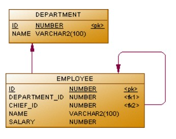

# Departaments_employee
 
There're all IDs departments of a certain company in table DEPARTMENTS.
There're all IDs employees, thier departments, wages and leaders.

**Tasks**:
1. Find employees with wage more than 50 000 rubles 
2. Find departments which haven't employees
3. Display department, names of employees and their leaders, if departments have employees
4. Display department and average wage of it. If departments haven't employees, then display 0
5. Find departments which have average wage more than 50 000 rubles
6. Display department and his leaders if wage of a leader less than max wage in this department
7. Find employees with leader who work in the different department 
